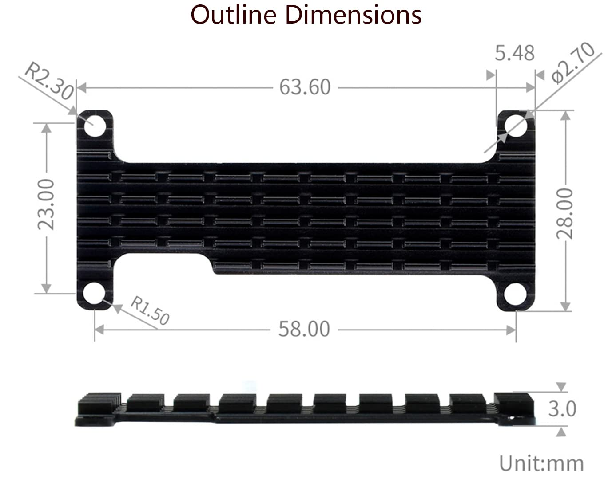

# beepy-case

Beepy case with a cooling fin and a metal kick stand

## Parts List

- Two printed parts (beepy_front, beepy_back_v2)
- One sheet metal stand (stand_v2)
- One cooling fin
- Two hand screws (2.5x5x5)
- Four thin gaskets (2.5x5x0.5)
- Eight plastic gaskets (2.5x5x1, paired and padded on the bolt holes between the cooling fin and the raspberry pi)
- Four injection molded nuts (2.5x3.5x3)
- Six screws (2.5x5x8)
- Two screws (2.5x5x6)

## Instructions

